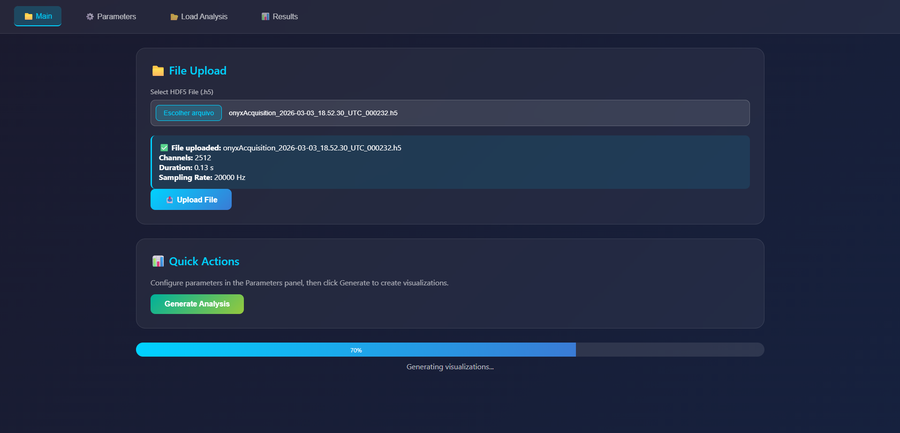
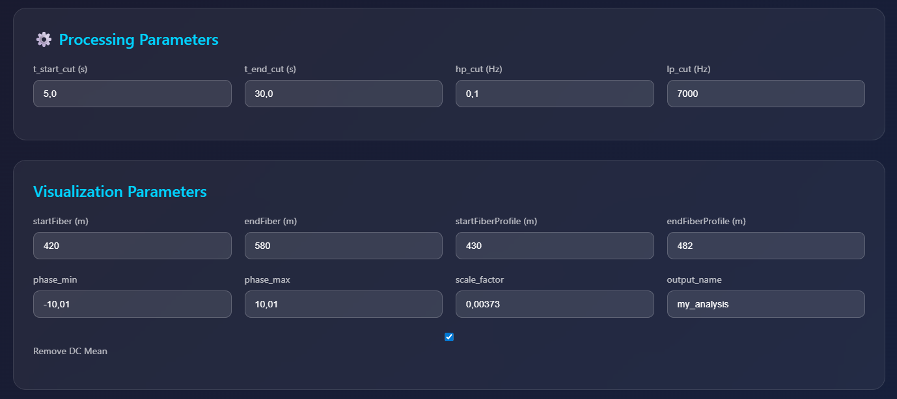
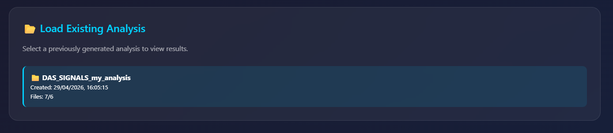
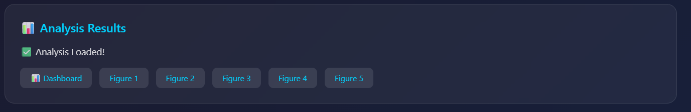
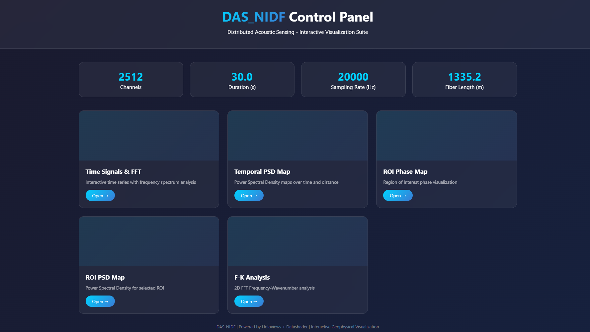

# DAS_NIDF - Distributed Acoustic Sensing Data Visualization

[](https://python.org)  
[](https://pypi.org/project/das-nidf/)  
[](https://pypi.org/project/das-nidf/)  

---

## Overview

**DAS_NIDF** is a comprehensive Python library for visualizing and analyzing **Distributed Acoustic Sensing (DAS)** data. It provides interactive, high-performance visualization tools using **Holoviews + Datashader**, capable of handling billions of data points.

Developed exclusively for internal use by the **Núcleo Interdisciplinar de Dinâmica dos Fluidos (NIDF)**.

> **Restricted Use Notice:** This package was created specifically for research and technical activities within NIDF and is not intended for public or commercial use.

---

## Features

- **Interactive Waterfall Plots** - Real-time zoom, pan, and hover  
- **Spectrogram Analysis** - Integrated band power maps  
- **Frequency-Wavenumber (f-k) Analysis** - 2D FFT for wavefield analysis  
- **ROI Analysis** - Region of Interest extraction and visualization  
- **Customizable Colormaps** - Viridis, Plasma, and more  
- **High Performance** - Datashader rendering for large datasets  
- **Interactive Dashboard** - All plots combined in a single HTML page  
- **Complete Processing Pipeline** - From HDF5 to visualization  

---

## Installation

### From PyPI (authorized internal users only)

```bash
pip install das-nidf
```

---

## Dependencies

Automatically installed with the package:

- numpy >= 1.20.0  
- scipy >= 1.7.0  
- h5py >= 3.0.0  
- holoviews >= 1.15.0  
- datashader >= 0.14.0  
- bokeh >= 2.4.0  
- scikit-image >= 0.19.0  

---

## 🚀 Quick Start

```python
from DAS_NIDF import run_server
run_server()
```

---

## 📖 Detailed Usage

### 1. Complete Processing Pipeline

The `process_full_pipeline()` method handles:

- Reads HDF5 file  
- Extracts metadata (`fs`, `dx`, `num_locs`)  
- Applies temporal cutting  
- Removes DC mean  
- Applies bandpass filter  


### 1. Main Interface & File Upload

The **Main** tab allows users to upload raw HDF5 data files. It automatically extracts and displays key file metadata (channels, duration, and sampling rate) and provides a "Quick Actions" panel to trigger the analysis generation with a real-time progress bar.

### 2. Parameters Configuration

The **Parameters** tab gives users full control over the data processing. It is divided into two main sections: **Processing Parameters** (for setting time windows and frequency filters like high-pass and low-pass) and **Visualization Parameters** (for defining spatial boundaries along the fiber, phase limits, and naming the output).

### 3. Load Existing Analysis

The **Load Analysis** tab enables users to browse and select previously generated analysis runs. This allows for quick retrieval of past results without the need to reprocess the heavy raw data files.

### 4. Results Navigation

Once an analysis is successfully generated or loaded, the **Results** tab displays quick-access buttons. Users can easily navigate to the main interactive dashboard or open individually generated static figures (Figure 1 through 5) for quick inspection.

### 5. Interactive Visualization Dashboard

The core **DAS_NIDF Control Panel** dashboard provides a quick summary of the dataset and acts as a hub for various interactive modules. Users can open specific tools such as Time Signals & FFT, Temporal PSD Maps, ROI Phase Maps, and F-K Analysis.


---

## 🔒 License / Usage Policy

This software is intended solely for internal academic and technical use within **NIDF**. Redistribution, resale, external deployment, or unauthorized modification may be restricted.

For access requests or collaboration inquiries, please contact the maintainers.

---

## 🌟 Acknowledgments

- HoloViz team for Holoviews and Datashader  
- Bokeh team for interactive visualization  
- NIDF - UFRJ for research support  